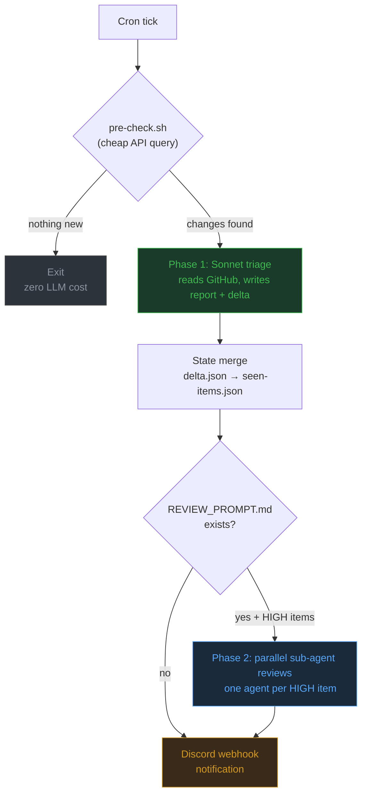

# agent-monitor

A cron-driven framework for monitoring GitHub repositories using Claude as a triage agent. Define what to watch and what matters. The framework handles state tracking, deduplication, pre-flight cost gating, optional deep-dive sub-agent reviews, and Discord notifications.

## Why

A standards working group publishes 30 PRs a week across three repos. Five of those touch your active proposal. You find out two days late because you were heads-down on implementation, and now the comment window has closed.

That is the problem. Manual "check GitHub every few hours" does not scale past a handful of repos, and GitHub's built-in notifications are a firehose with no materiality filter. You get pinged for bot comments, CI status, and dependency bumps alongside the PR that conflicts with your architecture.

agent-monitor replaces that routine with a cron job. Every few hours, it checks your tracked repos, asks Claude to assess what actually matters given your context, and sends you a Discord message with only the items that need your attention. It tracks what it has already reported, so you never see the same item twice unless something changed.

### Time savings

The manual version of this workflow takes 10-20 minutes per check: open each repo, scan recent PRs, read the ones that look relevant, decide if action is needed. At three checks per day across a handful of repos, that is 30-60 minutes of context-switching overhead. agent-monitor compresses that into a Discord notification you read in 30 seconds. The monitors run in the background while you work.

### API cost

Most cron ticks cost nothing. The pre-check script queries the GitHub API directly and short-circuits before invoking Claude when nothing has changed. In practice, roughly 80-90% of runs exit at the pre-check stage. When the LLM does run, a single Sonnet triage call typically costs $0.01-0.03. A monitor checking every 4 hours costs under $2/month.

## How it works



## Sample output

<details>
<summary>Example Discord notification</summary>

```json
{
  "embeds": [{
    "title": "Security Advisories: 2 items need attention",
    "description": "new [facebook/react#28234](https://github.com/facebook/react/pull/28234) -- fix: XSS in dangerouslySetInnerHTML sanitizer (ghsa-bot)\n**What:** Critical sanitization bypass in React DOM server rendering\n**Do:** Check if your SSR output uses dangerouslySetInnerHTML with user input\n\nnew [vercel/next.js#61234](https://github.com/vercel/next.js/pull/61234) -- fix: path traversal in image optimization (styfle)\n**What:** Unauthenticated path traversal via crafted image URL\n**Do:** Upgrade next.js if running < 14.1.2\n",
    "color": 15158332,
    "footer": {"text": "security-advisories | 2026-04-03 | 0 reviews"}
  }]
}
```

</details>

<details>
<summary>Example triage report (markdown)</summary>

```markdown
# Security Advisories Report - 2026-04-03

**Period:** 2026-04-03T02:00:00Z to now
**Items found:** 2 new security-relevant items

## HIGH

### facebook/react#28234 - fix: XSS in dangerouslySetInnerHTML sanitizer (ghsa-bot)
**What happened:** Security advisory published for React DOM. A crafted
HTML string can bypass the sanitizer when rendered server-side.
**Context:** CVE-2026-XXXX, CVSS 8.1. Affects react-dom >= 18.0.0.
**Action:** Audit SSR code paths for dangerouslySetInnerHTML usage with
user-controlled input. Upgrade to react-dom 18.2.1+ when released.

### vercel/next.js#61234 - fix: path traversal in image optimization (styfle)
**What happened:** Unauthenticated path traversal via /_next/image endpoint.
Attacker can read arbitrary files on the server.
**Context:** Affects Next.js < 14.1.2 with default image optimization enabled.
**Action:** Upgrade immediately if running affected version in production.

## Summary

- 2 high items, 0 medium items
- Key actions: audit React SSR sanitization, upgrade Next.js
```

</details>

## Requirements

- [Claude Code CLI](https://docs.anthropic.com/en/docs/claude-code) (`claude`)
- [GitHub CLI](https://cli.github.com/) (`gh`), authenticated
- `jq`
- A Discord webhook URL (optional, for notifications)

## Quick start

```bash
# 1. Clone
git clone https://github.com/erik-sv/agent-monitor.git
cd agent-monitor

# 2. Configure
cp .env.example .env
# Edit .env with your Discord webhook URL

# 3. Pick a monitor (or create your own from the example)
cp -r monitors/security-advisories monitors/my-project
# Edit monitors/my-project/monitor.conf, PROMPT.md, and pre-check.sh

# 4. Run manually
./run.sh my-project --lookback

# 5. Add to crontab
crontab -e
# 15 */4 * * *  /path/to/agent-monitor/cron-wrapper.sh my-project
```

## Included monitors

| Monitor | What it watches | Suggested schedule |
|---------|----------------|-------------------|
| [`example`](monitors/example/) | Generic repo watcher template. Copy and customize. | - |
| [`security-advisories`](monitors/security-advisories/) | Security-related PRs and issues across repos you depend on. | Every 4 hours |
| [`release-tracker`](monitors/release-tracker/) | New releases and tags on upstream dependencies. | Twice daily |

Each monitor is a self-contained directory you can copy, edit, and run independently.

## Creating a monitor

Each monitor lives in `monitors/<name>/` and contains:

| File | Required | Purpose |
|------|----------|---------|
| `monitor.conf` | Yes | Shell variables: `LOOKBACK_HOURS`, `DISCORD_EMBED_COLOR`, `MONITOR_DISPLAY_NAME` |
| `PROMPT.md` | Yes | The triage agent prompt. Uses placeholder variables that get interpolated at runtime. |
| `pre-check.sh` | No | Cheap API gate. Exit 0 = changes found, exit 1 = skip. Prevents unnecessary LLM calls. |
| `REVIEW_PROMPT.md` | No | Per-item deep-dive prompt. Enables Phase 2 parallel sub-agent reviews for HIGH items. |
| `.env` | No | Per-monitor environment overrides (e.g. a different Discord webhook). |

### Prompt variables

These placeholders in `PROMPT.md` and `REVIEW_PROMPT.md` are interpolated at runtime:

| Variable | Value |
|----------|-------|
| `LAST_CHECK_TIME` | ISO 8601 timestamp of the previous run |
| `LAST_CHECK_DATE` | Date portion of the above (YYYY-MM-DD) |
| `DATE` | Today's date |
| `REPORT_OUTPUT_PATH` | Where the agent should write its markdown report |
| `DELTA_OUTPUT_PATH` | Where the agent should write delta.json (state tracking) |
| `DISCORD_OUTPUT_PATH` | Where the agent should write the Discord payload |
| `SEEN_ITEMS_JSON` | Contents of seen-items.json (for dedup in prompt) |

For `REVIEW_PROMPT.md`, additional variables are available:

| Variable | Value |
|----------|-------|
| `ITEM_REPO` | e.g. `owner/repo` |
| `ITEM_NUMBER` | e.g. `123` |
| `ITEM_TYPE` | `pr` or `issue` |
| `ITEM_GH_CMD` | `pr view` or `issue view` |
| `REVIEW_OUTPUT_PATH` | Where to write the review markdown |

## State management

State lives in `state/<monitor-name>/`:

- **`seen-items.json`** tracks every reported item with its `lastReportedUpdate` timestamp. The triage prompt receives this data and skips items that have not changed since last report.
- **`last-check.txt`** records when the monitor last ran. The next run queries only activity after this timestamp.
- **`delta.json`** (transient) holds newly reported items from the current run, then merges into `seen-items.json`.

Three layers of deduplication work together:

1. **Shell-level gate** (`pre-check.sh`): queries the GitHub API before the LLM runs. If nothing has changed since `last-check.txt`, the run exits immediately. No API credits spent.
2. **LLM-level dedup**: the triage prompt receives `seen-items.json` and skips items whose `updatedAt` matches `lastReportedUpdate`. Items only resurface when something new happens.
3. **Delta merge**: after triage, `delta.json` folds into `seen-items.json` so the next run knows what was already reported.

## CLI flags

```
./run.sh <monitor-name> [--lookback] [--reset] [--no-review]
```

| Flag | Effect |
|------|--------|
| `--lookback` | Ignore `last-check.txt` and check the full `LOOKBACK_HOURS` window. Bypasses pre-check. |
| `--reset` | Clear `seen-items.json` and treat everything as new. Bypasses pre-check. |
| `--no-review` | Skip Phase 2 sub-agent reviews even if `REVIEW_PROMPT.md` exists. |

## Configuration

Global settings go in `.env` at the repo root. Per-monitor overrides go in `monitors/<name>/.env`.

| Variable | Default | Purpose |
|----------|---------|---------|
| `DISCORD_WEBHOOK_URL` | (none) | Discord webhook for notifications |
| `DASHBOARD_BASE_URL` | (none) | Base URL for session links in Discord embeds |
| `TRIAGE_MODEL` | `claude-sonnet-4-6` | Model for Phase 1 triage |
| `REVIEW_MODEL` | `claude-sonnet-4-6` | Model for Phase 2 reviews |

## Discord notifications

Two notification modes are supported:

1. **LLM-generated payload:** The triage prompt writes a Discord-ready JSON file directly. Best for monitors where the LLM should control formatting and urgency tiers.

2. **Shell-built embed:** The framework reads `delta.json` and builds a Discord embed from HIGH items, appending review findings and dashboard links. Best for monitors with structured delta output and Phase 2 reviews.

The mode is selected automatically based on which output files the triage agent produces.

## License

Apache 2.0. See [LICENSE](LICENSE).
